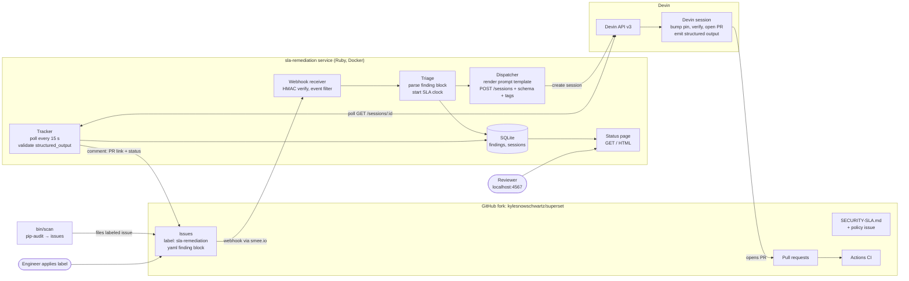

# sla-remediation

A Ruby service that turns known-vulnerable Python dependencies into fixed pull
requests inside a security SLA. A scanner files each vulnerable dependency in a
GitHub repository as a labelled issue; each issue starts a Devin session that
opens a fix pull request; a tracker records the session's progress and
comments the pull request on the issue; and a status page shows whether every
finding is inside the security SLA, the number of days a fix is allowed to
take, by severity.

In more detail: a GitHub issue on the target repository with the
`sla-remediation` label carries a `yaml` finding block (`package, pinned,
fix_version, advisories[], severity, source`); the service receives the
`issues` webhook, verifies its signature, computes the due date from the
repository's `SECURITY-SLA.md`, stores the finding in SQLite, and starts a
Devin session with a rendered prompt and a structured output schema. A tracker
polls each session every 15 s, records its status, ACUs consumed, and pull
request, comments on the issue with the PR link, and a status page lists every
finding against its SLA due date.

## Why

Dependency vulnerabilities pile up because nobody owns the fix: a scanner
reports them, the report is read, and the pins stay where they are. The SLA
policy in the target repository's
[`SECURITY-SLA.md`](https://github.com/kylesnowschwartz/superset/blob/master/SECURITY-SLA.md)
names the deadline for each severity, and this service makes that deadline
visible and hands the routine fixes to Devin. The decision to keep the policy
in the repository is
[decision 1](docs/decisions/0001-sla-policy-lives-in-the-repo.md).

## How it works



The data flows, in the order of a single remediation:

1. **Detection → issue.** `bin/scan` (deterministic) or a human files/labels
   an issue on the fork. The issue body carries a fenced `yaml` finding
   block: `package, pinned, fix_version, advisories[], severity, source`.
   The due date is computed by the service (issue `created_at` + the
   `SECURITY-SLA.md` window), not carried in the block.
2. **GitHub → service.** GitHub POSTs the `issues` event to the smee channel;
   the smee client forwards it to `POST /webhooks/github`. The receiver
   verifies `X-Hub-Signature-256`, accepts `opened`-with-label or `labeled`
   (start) and `closed` on a tracked issue (remediated), ignores everything
   else.
3. **Service → DB.** Triage parses the finding block, computes the SLA
   deadline from `SECURITY-SLA.md`'s windows, and inserts a `finding` row.
   Uniqueness on issue number makes duplicate deliveries a no-op.
4. **Service → Devin.** The dispatcher renders the prompt template with the
   finding, then `POST /v3/organizations/{org}/sessions` with `prompt`,
   `repos`, `tags`, `title`, `resumable: false`, `max_acu_limit`,
   `structured_output_schema`. It stores `session_id`, `url`, `status`.
5. **Devin → GitHub.** The session bumps the pin, verifies with pip-audit,
   opens a PR on the fork referencing the issue, and records its structured
   output.
6. **Service ← Devin.** The tracker polls each open session every 15 s,
   records `status`, `status_detail`, `pull_requests[]`, `acus_consumed`,
   `structured_output` (validated against the schema once, at this
   boundary). Terminal: `exit`/`error`; `suspended`+`inactivity` = stalled.
7. **Service → GitHub.** On first PR detection the Notifier comments on the
   issue with the PR link and session summary.
8. **DB → humans.** The status page lists findings with SLA due, session
   state, PR link, ACUs consumed, time-to-PR.

The actors and their boundaries are described further in
[docs/architecture.md](docs/architecture.md).

## Try it without credentials

The status page can be filled from a captured run, with no GitHub token,
webhook secret, or Devin key. With Docker and the Compose plugin installed:

```sh
docker compose up app --build --detach --wait
docker compose run --rm app bin/demo-load
```

then open http://localhost:4567. What you are looking at is the status page
from a real run against the demo fork, `kylesnowschwartz/superset`, with
every timestamp shifted so the capture happened at the moment you loaded it:
a major-version upgrade, two pin bumps, and one finding with no fixed release
that stays waiting with its clock running. The intervals between events are
the ones the run had, so every SLA word is the one the run earned, and the
page ages from here at the same rate a live run would. The page names the
fork from the loaded rows, so `SLA_REPO` can stay unset. Expand a row to see
the session's report and the state of the pull request's checks. Scanning and
dispatching are not exercised in this mode: nothing is read from GitHub and
no Devin session is started. The first command starts only the web server;
the loaded sessions are already closed, so a tracker would have nothing to
poll and is left out. To run the whole loop, see
[Run it against your own fork](#run-it-against-your-own-fork).

`bin/demo-load` refuses to write into a database that already has findings
or sessions; `bin/demo-load --replace` empties both tables first. The fixture
is `db/fixtures/demo.json`, written by `bin/demo-export` from a live
database; nothing in it is secret.

## Run with Docker

You need Docker with the Compose plugin (`docker compose version` prints a
version) and a value for each variable in `.env.example`: the fork to point
the service at, a GitHub token for it, the webhook secret, a Devin service
key and organization ID, and the smee channel URL. The next section says
where each one comes from. Copy `.env.example` to `.env` and fill it in;
Compose reads `.env` both for the containers' environment and for the
`${SMEE_URL}` in the compose file (`.env` is ignored by git):

```sh
cp .env.example .env
```

Then build the image and start the three services:

```sh
docker compose up --build --detach --wait
```

and open http://localhost:4567 for the status page. `curl
localhost:4567/healthz` returns `{"ok":true}`.

The one-off commands run in the same image, with the same variables and the
same database:

```sh
docker compose run --rm app bin/scan
docker compose run --rm app bin/demo-reset
docker compose run --rm app bin/dispatch <issue_number>
```

The database is a SQLite file on the named volume `sla-db`, shared by the web
server and the tracker. `docker compose down -v` deletes it. The `app`
service also mounts the repository's `db/fixtures/` directory, so a fixture
written inside the container lands in the working tree.

## Run it against your own fork

With a Devin service key, the whole loop runs against a fork of your own:
the scanner files issues on it, Devin opens pull requests on it, and the
status page follows them.

1. Fork `kylesnowschwartz/superset`, not `apache/superset`, so that
   `SECURITY-SLA.md`, the `sla-remediation` and `policy` labels, and the
   seeded pins in `requirements/base.txt` come along. Nothing is ever opened
   against `apache/superset`.
2. Create a fine-grained GitHub personal access token scoped to the new fork
   with read and write access to contents, issues, and pull requests. This is
   `SLA_GITHUB_TOKEN`. The service reads `SECURITY-SLA.md` from the fork on
   the first webhook delivery; without a token that read counts against
   GitHub's small anonymous rate limit and can fail on a shared network.
3. Get a Devin API v3 *service* key and the Devin organization ID. Only a
   service key works for the v3 API; a personal key does not. In the Devin
   web app, open the organization settings, create a service user, and create
   an API key for it. The organization ID is the `org-...` value in the same
   settings page. These are `DEVIN_SERVICE_API_KEY_V3` and `DEVIN_ORG_ID`.
4. Create a smee channel, so that GitHub can deliver webhooks to a machine
   without a public address, and read its URL from the `Location` header:

   ```sh
   curl -sI https://smee.io/new | grep -i location
   ```

   This is `SMEE_URL`. Then, on the fork, open Settings → Webhooks → Add
   webhook and set the payload URL to that smee URL, the content type to
   `application/json`, the secret to a random string you keep as
   `SLA_WEBHOOK_SECRET`, and the events to "Issues" only.
5. Set `SLA_REPO` to the new fork's `owner/name` in `.env`, along with the
   values above, and `SLA_AUTO_DISPATCH=true` if a labelled issue should start
   a Devin session on its own.
6. Start the services, put the fork in its starting state, and scan it:

   ```sh
   docker compose up --build --detach --wait
   docker compose run --rm app bin/demo-reset
   docker compose run --rm app bin/scan
   ```

The scan files one issue per vulnerable pin, the webhook reaches the service
through smee, each finding starts a Devin session, and http://localhost:4567
follows the pull requests as they open and their checks run.

## Run locally without Docker

With Ruby 3.3 installed (`.ruby-version` names the exact patch release for version managers such as rbenv, which reject a bare minor version; any 3.3.x satisfies the `Gemfile`):

```sh
bundle install
bundle exec rake      # test + lint
bin/server            # Puma on http://localhost:4567
```

`curl localhost:4567/healthz` returns `{"ok":true}`.

In a second terminal, start the tracker, and in a third, the smee client
that forwards the fork's webhooks to the server:

```sh
bin/track --loop
npx --yes smee-client --url "$SMEE_URL" --target http://localhost:4567/webhooks/github
```

`bin/scan` runs pip-audit through `uvx`, so it needs
[`uv`](https://docs.astral.sh/uv/) on the path.

## Configuration

Read from the shell or `.env`:

- `DEVIN_SERVICE_API_KEY_V3` — Devin API v3 service-user key used to create and poll sessions.
- `SLA_GITHUB_TOKEN` — GitHub token for reading issues and commenting on them in the target repo.
- `SLA_WEBHOOK_SECRET` — shared secret for verifying `X-Hub-Signature-256` on incoming GitHub webhooks.
- `DEVIN_ORG_ID` — Devin organization ID that sessions are created under.
- `SLA_REPO` — `owner/name` of the GitHub repo whose findings the service remediates.
- `SLA_AUTO_DISPATCH` — set to `true` so a labelled issue starts a Devin session automatically; leave unset to only record findings.
- `SMEE_URL` — the smee.io channel URL that the fork's webhook points at; only the smee client reads it.

`SLA_DATABASE_URL` (optional) overrides the Sequel connection string; it defaults to `sqlite://db/sla.sqlite3`, and the Docker image sets it to `sqlite:///app/data/sla.sqlite3`.

## The demo fork

The demo runs against `kylesnowschwartz/superset`, a fork of Apache Superset.
Nothing is ever opened against `apache/superset`: issues, branches, and pull
requests all stay on the fork.

Superset keeps its pins current, so an unmodified fork has almost nothing for
the scanner to find. Two pins in the fork's `requirements/base.txt` were
therefore deliberately lowered to versions with published advisories, so that
the scanner has something to report and the demo can be run more than once.
The pins and their seeded versions are listed in `demo/seeds.yml`, the commit
that lowers them says that they are seeds, and `bin/demo-reset` puts them back
to those seeded values after a run. The advisories are real and every fix is
a real upgrade; the service does not know which findings were seeded
([decision 2](docs/decisions/0002-seeded-findings-are-real-advisories.md)).

## Devin API client

`SLA::DevinClient` (`lib/sla/devin_client.rb`) wraps the Devin API v3 over Faraday: list repositories, create/fetch sessions, and list/send session messages, raising `SLA::DevinAPIError` on any non-2xx.
Repositories are served from `/v3beta1/organizations/{org}/repositories`; the `/v3/` path returns 404.
`Session#structured_output` is normalised: the API returns a JSON object when the session was created with a schema and the string `"null"` when it was not, so a Hash is kept, a String is `JSON.parse`d, and `nil` means no output yet.
`bin/devin-smoke` (needs `DEVIN_SERVICE_API_KEY_V3` and `DEVIN_ORG_ID`) lists repositories and fetches one known session read-only; without the variables it names the missing ones and exits 1.

## Dispatching

A dispatch (`SLA::Dispatcher`, `lib/sla/dispatcher.rb`) renders `prompts/remediate_dependency.md.erb` for one recorded finding, creates a Devin session through `DevinClient`, and inserts one `sessions` row for the finding; a unique index on `sessions.finding_id` means a finding is dispatched exactly once, ever.
The session is created with the issue title, `repos: [SLA_REPO]`, `tags: ["sla-remediation", "issue-<n>"]`, `schemas/remediation_result.json` as `structured_output_schema`, `max_acu_limit: 3`, and `resumable: false`.
Before creating a session the dispatcher asks GitHub whether `fix/<package>-sla-<issue_number>` already exists as a branch or an open pull request in `SLA_REPO`; if so the finding counts as already dispatched.
With `SLA_AUTO_DISPATCH=true` the webhook dispatches every finding it records (result logged as `dispatch=` on the delivery line); by default it only records the finding.
A failed auto-dispatch (logged as `dispatch=error (<message>)`) keeps the finding row, creates no session, and is not retried automatically; retry it by hand with `bin/dispatch <issue_number>`.
`bin/dispatch <issue_number>` (needs `DEVIN_SERVICE_API_KEY_V3`, `DEVIN_ORG_ID`, `SLA_REPO`) dispatches one finding by hand and exits 0 for `dispatched` or `already_dispatched`; `--dry-run` prints the rendered prompt and the request payload as JSON without creating anything.
Findings with no fix version (`fix_version: null` in the finding block) are never dispatched: the dispatcher returns `not_fixable` and creates nothing.

## Tracking

The tracker (`SLA::Tracker`, `lib/sla/tracker.rb`) is a separate process from the web server: `bin/track --loop` polls every open session every 15 s, and `docker compose` runs it as its own service. It needs `DEVIN_SERVICE_API_KEY_V3` and `DEVIN_ORG_ID`; `bin/track` without `--loop` runs one round and prints the summary (`polled= settled= stalled= notified= errors=`).
Each round records `status`, `status_detail`, `acus_consumed`, the first pull request's URL and state, and the structured output on the `sessions` row, and logs one line when a session's status changes.
A session is judged `settled` once it has stopped working (status `exit` or `error`, or status detail `waiting_for_user`, `finished`, or `inactivity`) with a structured output or a pull request, and `stalled` once it has stopped with neither; either outcome closes the row and it is never fetched from Devin again.
Each round also reads the pull request's check runs and merge state from GitHub and records `pr_checks` (`pending`, `failure`, `success`, or `none`), when that state was first observed, and `pr_merged_at`. A closed row keeps having its pull request checked until the pull request is green, merged, or closed, so a finding is judged by whether its fix passed CI, not by whether a session finished.
The first time a row has a pull request the notifier comments on the finding's issue (pull request link, session link, due date and whether it is inside or past the SLA window); `pr_notified_at` is written before the comment is posted and cleared if posting fails, so the comment is posted exactly once.
The comment needs `SLA_GITHUB_TOKEN`; without it the `Null` notifier is used and nothing is posted.
A structured output that does not match `schemas/remediation_result.json` is kept as JSON text in `structured_output_invalid` with a logged warning naming the first problem; nothing is discarded.

## Status page

`GET /` (http://localhost:4567/ locally) is a dense, monospaced, terminal-style page that reloads itself every 15 s. One summary line answers the leader's question: findings tracked, findings fixed inside their SLA window, findings that have breached it, and the median time from session start to a green pull request. Below it is one row per finding, sorted by severity and then by due date, with the issue, package and versions, severity, the due date, the SLA word, what the Devin session is doing, and the pull request. A checkbox-and-label toggle next to each row expands a second, CSS-only detail row underneath it with the finding's title, filed time, advisories, source, session status, start time, time to PR, check state, ACUs, and lockfile verification.
`SLA::StatusPage` (`lib/sla/status_page.rb`) reads findings left-joined to sessions and decides everything; `views/status.html.erb` only prints it. A finding is fixed when its pull request is merged or its checks pass. The SLA word is decided in this order:

- `met` — the pull request was merged or its checks passed at or before the due date.
- `late` — the pull request was merged or its checks passed after the due date.
- `breached` — the due date has passed without a green pull request.
- `ci failing` — the pull request's checks are red and the due date has not passed.
- `in progress` — a session exists (or a pull request is waiting on checks) and the due date has not passed.
- `stalled` — no pull request, and the session stopped without a report (`outcome` is `stalled`).
- `waiting` — no session and the due date has not passed. A finding with no fixed release stays here with its clock running; it needs a policy decision, not a code change.

ACUs read `not reported` when the API returns nil or 0.0: this organisation's usage is not metered through the API, so 0.0 does not mean free; time to PR and time to green in the detail row are the cost signals for now.

## Resetting the demo

One run of the pipeline leaves the fork with open `sla-remediation` issues, a Devin pull request from a `fix/...` branch, and a bumped pin, and leaves the local database with the findings and sessions. `bin/demo-reset` (`SLA::DemoReset`, `lib/sla/demo_reset.rb`) undoes all of it, in this order, printing one line per thing done or skipped: closes (without merging) every open pull request whose head branch starts with `fix/` and deletes the branch; comments on and closes every open issue labeled `sla-remediation` (issues with other labels, including the `policy` issue, are never touched); puts the pins in `demo/seeds.yml` back to their seeded vulnerable versions in `requirements/base.txt` on `master` in one commit, or skips the commit when they already have those values; and deletes every `sessions` row, then every `findings` row. It does not run the scan.
Running it twice in a row is safe: the second run finds nothing to close, restore, or delete, and says so. `bin/demo-reset --dry-run` prints what each step would do and changes nothing on GitHub or locally.
It needs `SLA_REPO` and `SLA_GITHUB_TOKEN`, and the token needs write access to contents, issues, and pull requests on the fork.

A fresh demo run is the reset followed by the scan:

```sh
bin/demo-reset && bin/scan
```

After a good run, before the reset, `bin/demo-export` writes the findings and
sessions to `db/fixtures/demo.json`, the fixture that `bin/demo-load` shows
to a reader without credentials; under Compose that is
`docker compose run --rm app bin/demo-export`, and the file appears in the
working tree through the `db/fixtures/` mount. It refuses to write from an
empty database, so a run against the wrong database cannot replace a captured
fixture with nothing.

## In production

- Webhook delivery is best-effort, so a scheduled reconcile that lists the
  open labelled issues and dispatches any that have no session replaces
  reliance on the webhook.
- The smee relay is replaced by the team's normal inbound routing; the
  endpoint and the signature check do not change.
- SQLite becomes either a cache that can be rebuilt from GitHub and the Devin
  API, or a real database.
- Merging a fix pull request automatically, if ever, uses GitHub's own
  auto-merge behind a repository setting and required checks; the service
  never merges.

## Decisions

- 1\. [Service Level Agreements are defined in this repo](docs/decisions/0001-sla-policy-lives-in-the-repo.md) — every target repository carries a `SECURITY-SLA.md` with the window in days per severity, and the service reads it to set each finding's due date.
- 2\. [Demo findings are seeded, but the advisories are real](docs/decisions/0002-seeded-findings-are-real-advisories.md) — the demo lowers a few pins on the fork to versions with published advisories so it can be run more than once, and the service treats them like any other finding.
- 3\. [We poll Devin for session status](docs/decisions/0003-poll-devin-sessions.md) — Devin has no outbound webhook, so a tracker polls each open session every 15 s and judges it done when it has stopped working with a structured output or a pull request.
- 4\. [A labeled GitHub issue is the unit of work](docs/decisions/0004-issue-is-the-unit-of-work.md) — a finding is an issue with the `sla-remediation` label and a `yaml` finding block, and the `issues` webhook starts and finishes the remediation.
- 5\. [Detection is a script; remediation is the agent](docs/decisions/0005-deterministic-detection-agentic-remediation.md) — `bin/scan` is plain Ruby around pip-audit and the GitHub Advisory Database, and Devin is only involved once an issue exists.
- 6\. [We call the sessions API instead of configuring a Devin Automation](docs/decisions/0006-why-not-a-devin-automation.md) — an Automation starts a session when an event fires, but this service owns the finding's lifecycle and its SLA clock, so it calls the same sessions API itself.
- 7\. [A smee.io channel relays GitHub webhooks to the developer's machine](docs/decisions/0007-smee-relays-webhooks-in-development.md) — the relay is unauthenticated, so the webhook signature check, not the relay, is the security boundary.

## Development

```sh
bundle exec rake        # tests and lint (rubocop, then the Herb ERB linter)
bundle exec rake test
bundle exec rake lint
```

The Herb linter for the templates on its own:

```sh
npx --yes @herb-tools/linter views/ "templates/**/*.erb"
```

No API key may ever be committed. Devin API keys start with `cog` and an
underscore, so before pushing, this must print nothing:

```sh
git grep -n 'cog[_]'
```
