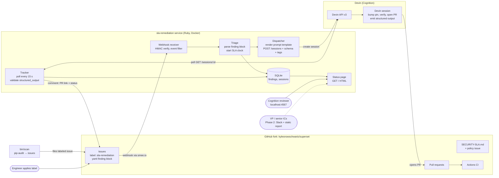

# Architecture

Every box is a named actor; every arrow is one data flow with its direction.
Rendered: `architecture.png` (regenerate with `mmdc -i architecture.mmd -o architecture.png -b white -s 2 -w 1600`).

## Data flows, in order of a single remediation

1. **Detection → issue.** `bin/scan` (deterministic) or a human files/labels
   an issue on the fork. The issue body carries a fenced `yaml` finding
   block: `package, pinned, fix_version, advisories[], severity, source`.
   The due date is computed by the service (issue `created_at` + the
   `SECURITY-SLA.md` window), not carried in the block.
2. **GitHub → service.** GitHub POSTs the `issues` event to the smee channel;
   the smee client forwards it to `POST /webhooks/github`. The receiver
   verifies `X-Hub-Signature-256`, accepts `opened`-with-label or `labeled`
   (start) and `closed` on a tracked issue (remediated), ignores everything
   else.
3. **Service → DB.** Triage parses the finding block, computes the SLA
   deadline from `SECURITY-SLA.md`'s windows, and inserts a `finding` row.
   Uniqueness on issue number makes duplicate deliveries a no-op.
4. **Service → Devin.** The dispatcher renders the prompt template with the
   finding, then `POST /v3/organizations/{org}/sessions` with `prompt`,
   `repos`, `tags`, `title`, `resumable: false`, `max_acu_limit`,
   `structured_output_schema`. It stores `session_id`, `url`, `status`.
5. **Devin → GitHub.** The session bumps the pin, verifies with pip-audit,
   opens a PR on the fork referencing the issue, and records its structured
   output.
6. **Service ← Devin.** The tracker polls each open session every 15 s,
   records `status`, `status_detail`, `pull_requests[]`, `acus_consumed`,
   `structured_output` (validated against the schema once, at this
   boundary). Terminal: `exit`/`error`; `suspended`+`inactivity` = stalled.
7. **Service → GitHub.** On first PR detection the Notifier comments on the
   issue with the PR link and session summary. (Phase 2: also Slack.)
8. **DB → humans.** The status page lists findings with SLA due, session
   state, PR link, ACUs consumed, time-to-PR.

## Boundaries and seams

- `DevinClient` and `GitHubClient` are the only places that know HTTP; both
  are tested against recorded fixtures from the step-3 spike.
- `Notifier` is an interface with `IssueCommentNotifier` now and
  `SlackNotifier` in Phase 2.
- `Finding` owns SLA math and finding-block parsing; nothing else parses
  issue bodies.
- The prompt template and the structured-output schema live as files
  (`prompts/`, `schemas/`) — reviewable artifacts, not string literals.
