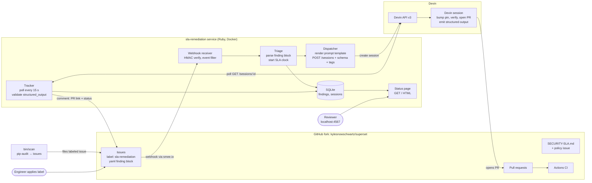

# Architecture

Every box is a named actor; every arrow is one directed data flow. The rendered copy is `architecture.png`; regenerate it with `mmdc -i architecture.mmd -o architecture.png -b white -s 2 -w 1600`.

## Data flow

1. `bin/scan` or an engineer files a labelled issue with a finding block.
2. smee forwards the signed GitHub webhook to `POST /webhooks/github`.
3. Triage parses the finding, calculates its due date, and stores it once.
4. The dispatcher renders `prompts/` and creates a resumable Devin session with `schemas/`.
5. Devin upgrades the pin, checks it, opens a pull request, and reports its result.
6. The tracker polls Devin, validates the result, and records session and pull-request state.
7. The tracker comments on the issue when it first sees the pull request.
8. When the pull request's checks are red, the tracker sends the failed runs back to the same session, once per red commit and at most twice ([decision 8](decisions/0008-ci-failures-go-back-to-the-session.md)).
9. The status page reads SQLite and shows each finding's SLA state.

## Boundaries

- Only `DevinClient` and `GitHubClient` know HTTP; both are tested against recorded fixtures.
- `Policy` owns SLA date math; `FindingBlock` owns finding-block parsing, and nothing else parses issue bodies.
- The prompt templates and structured-output schema are files under `prompts/` and `schemas/`, reviewable instead of string literals. `RemediationPrompt` renders the dispatch prompt and `RepairPrompt` the CI-repair message; the tracker composes no message text.

[Behavioural specifications](spec/README.md) define each slice's promises.
